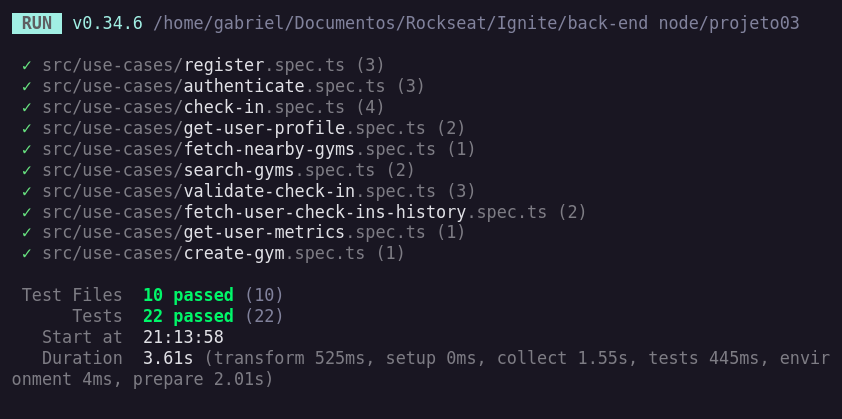
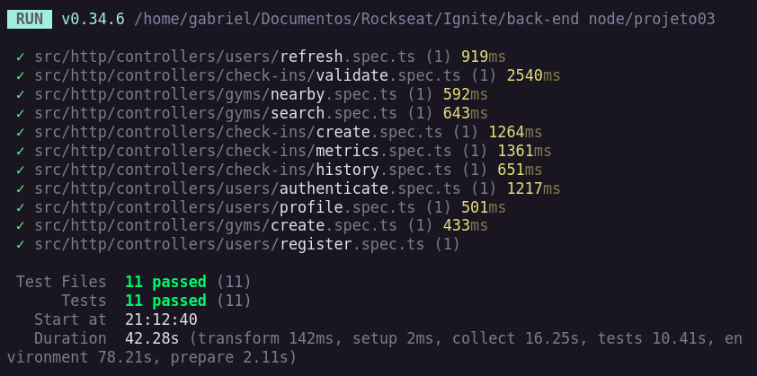

# GymPass style app.

Esse é uma api parecido com o GymPass, realizado no curso Ignite da rocketseat.
Essa aplicação não está em produção, então, para testar, é preciso rodar a API 
na sua máquina.

## Tecnologias Usadas
  - Nodejs
  - TypeScript
  - Docker
  - Fastify
  - Postgresql
  - Git
  - Zod
  - Vitest

## Requisitos:
- É preciso ter o [Docker](https://www.docker.com/) instalado
- É preciso ter o [Node.JS](https://nodejs.org/en) instalado
- É preciso ter o [Git](https://git-scm.com/) instalado

## Rodando API na sua máquina
  - Crie ou abra uma pasta onde deseja clonar o repositório
  - Clique em "<> Code" e copie o link da maneira que deseja clonar (HTTPS, SSH, GitHub CLI)
  - No seu terminal, dentro da pasta que deseja clonar, execute:
    ```
    git clone https://github.com/gabriel-vitebo/03-API-node-SOLID.git
    ```
    aqui estou utilizando HTTPS
  - Entre na pasta do repositório clonado, e execute o comando:
    ```
    npm install
    ```
  - Na raiz do projeto, você irá encontrar um arquivo chamado `.env.example`, entre nesse arquivo, copie as variáveis, crie um arquivo chamado `.env` na raiz do projeto e cole as variáveis.

  - Rode o comando
    ```
    npm run dev
    ```
  - Se tudo der certo, você deve visualizar no seu terminal a mensagem
    ```
    🟢 HTTP Server Running on Port 3333 
    ```
  - Agora, vamos rodar o Docker para subir o banco de dados postgresql, execute o comando:
    ```
    docker-compose up -d
    ```

  - Se tudo der certo, a aplicação já esta rodando na sua máquina pronto para testar

### Executando os testes
  - Ambos os testes, se você colocar um `:watch` na frente, os testes vao executar a cada alteração no código
  - Para executar os testes unitários:
    ```
    npm run test
    ```
    
  - Para executar os testes E2E:
    ```
    npm run test:e2e
    ```
    

### Utilizando a API


## Users
 ### Rota para criar usuário

- Utilize `POST` na rota:
  ```
  https://localhost:3333/users
  ```

  No Body da requisição, coloque em json, passando com os seguintes parâmetros:
  ```json
  {
    "name": "John Doe",
    "email": "JohnDoe@email.com",
    "password": "123456",
  }
  ```
  Quando fizer a request,a  resposta deverá ser status `201`

  IMPORTANTE: 
  - O password, tem que ter, no mínimo, 6(seis) caracteres
  - Por padrão, irá criar um user 'MEMBER', para mudar as permissões, no terminal execute
    ```
    npx prisma studio
    ```
  - Com o banco de dados aberto, entre na tabela de users, clique na coluna 'role', e mude a permissão para 'ADMIN'

### Rota para autentificar o usuário
  - Depois de criar a conta, tudo que o usuário for fazer, precisa está autentificado,
  para isso, utilize `POST` na rota
    ```
    https://localhost:3333/sessions
    ```
  
  - A resposta deverá ser status `200` mandando o token
  ```json
  {
	"token": "UmaHashGiganteComOTokenDoUsuario"
  }
  ```

### Rota para o RefreshToken

- Para o refresh token, utilize `PATCH` na rota
  ```
  https://localhost:3333/token/refresh
  ```
  
- A resposta deverá ser status `200` mandando um novo token
  ```json
  {
	"token": "UmNovoTokenMasContinuaSendoUmaHashGiganteComOTokenDoUsuario"
  }
  ```

## A partir daqui, todas as requisições, o usuário PRECISA estar autentificado
  - é obrigatório passar o `Bearer Token` para o authentication, caso contrario, a resposta será status `401` 

### Rota para buscar o perfil do usuário
- Utilize o `GET` na rota 
```
 https://localhost:3333/me
```

- A resposta deverá ser status `200` mandando o perfil do usuário
```json
{
	"user": {
		"id": "IdDoUsuário",
		"name": "John Doe",
		"email": "JohnDoe@email.com",
		"role": "MEMBER",
		"created_at": "2023-12-06T18:12:39.457Z"
	}
}
```
- Lembrando, o `role` da para modificar mudando diretamente no banco de dados,
algumas requisições o MEMBER não consegue fazer, apenas ADMIN

## Gyms
  ### Rota para criar um academia
  - Essa é uma request que apenas ADMIN podem fazer
  - Utilize o `POST` na rota
    ```
    https://localhost:3333/gyms
    ```
  - Passando no corpo da requisição
    ```json
    {
      "title": "random gym",
      "description": "this is a random gym",
      "phone": "123456789",
      "latitude": -23.5635196,
      "longitude": -46.6875853
    }
    ```
  - As coordenadas (latitude e longitude) foram pegas de um lugar aleatório de São Paulo em Pinheiros
  - Caso queira pegar as coordenadas perto de onde você mora, mas não sabe como fazer, [Clique aqui e descubra como pega as coordenadas](https://support.google.com/maps/answer/18539?hl=pt-BR&co=GENIE.Platform%3DDesktop)

  ### Rota para buscar academias perto
  - Utilize `GET` na rota
    ```
    https://localhost:3333/gyms/nearby
    ```
- E pela `Query` vamos passar as coordenadas
- Lembrando, aqui vamos passar as coordenadas do usuário, e não da academia
- A query ficará mais ou menos assim
  ```
  http://localhost:3333/gyms/nearby?latitude=-23.5632755&longitude=-46.6867963
  ```
- As coordenadas (latitude e longitude) foram pegas de um lugar aleatório de São Paulo em Pinheiros também, substitua por suas coordenadas caso queira.
- A resposta deverá ser status `200` listando todas as academias próximas ao usuário
  ```json
    {
    "gyms": [
      {
        "id": "gymidone",
        "title": "random gym",
        "description": "this is a random gym",
        "phone": "123456789",
        "latitude": "-23.5635196",
        "longitude": "-46.6875853"
      },
      {
        "id": "gymidtwo",
        "title": "random gym two",
        "description": "this is a random gym",
        "phone": "123456789",
        "latitude": "-23.5635196",
        "longitude": "-46.6875853"
      },
      {
        "id": "gymidthree",
        "title": "random gym three",
        "description": "this is a random gym",
        "phone": "123456789",
        "latitude": "-23.5635196",
        "longitude": "-46.6875853"
      }
    ]
  }
  ```
  - Essa rota so retornará academias que estejam até 10km do usuário.

  ### Rota para buscar academias
  - Utilize o `GET` na rota
    ```
      https://localhost:3333/gyms/search
    ```
  - Passando na `Query` o titulo da academia que deseja buscar
  - a query ficará mais ou menos assim
    ```
    http://localhost:3333/gyms/search?q=random%20gym
    ```
  - A resposta deverá ser status `200` mandando uma lista com as academias buscadas
    ```json
      {
        "gyms": [
          {
            "id": "GymId",
            "title": "random gym",
            "description": "this is a random gym",
            "phone": "123456789",
            "latitude": "-23.5635196",
            "longitude": "-46.6875853"
          }
        ]
    }

## Check-ins
  ### Rota para criar um check-in

  - utilize o `POST` na rota 
    ```
    https://localhost:3333/gyms/:gymId/check-ins
    ```
  - atente-se para mudar o `:gymId` pelo id da academia que quer fazer o check-in
  - Mandando para o corpo da requisição as coordenadas do usuário que está fazendo o check-in
    ```json
      {
        "latitude": -23.5632755,
        "longitude": -46.6867963
      }
    ```
  - A resposta deverá ser um status `201`
  - Caso queira verificar, abra o prisma studio, na tabela 'check-ins', observe que agora há um check-in registrado, com apenas a coluna de `validated_at` como null

### Rota para validar o check-in
  - Essa é uma request que apenas ADMIN podem fazer
  - Utilize o `PATCH` na rota 
    ```
    https://localhost:3333/check-ins/:checkInId/validate
    ```
  - atente-se para mudar o `:checkInId` pelo id do check-in que o usuário criou
  - A resposta deverá ser um status `204`
  - Caso queira verificar, abra o prisma studio, na tabela 'check-ins', observe que agora o campos `validated_at` agora está preenchido com a data que foi feito a validação
  
### Rota para pegar a quantidade de check-ins feito pelo usuário
  - Utilize o `GET` na rota
    ```
    https://localhost:3333/check-ins/metrics
    ```
  - Deverá retorna um status `200` mandando a quantidade de check-ins feito
    ```json
      {
	    "checkInsCount": 1
      }
    ```
### Rota para pegar o histórico de check-ins feito pelo usuário
  - Utilize o `GET` na rota
    ```
    https://localhost:3333/check-ins/history
    ```
  - Deverá retorna um status `200` mandando a o histórico de check-ins
    ```json
    {
      "checkIns": [
        {
          "id": "IdDoCheckIn",
          "created_at": "2023-12-06T21:08:15.815Z",
          "validated_at": "2023-12-06T21:10:54.684Z",
          "user_id": "IdDoUsuario",
          "gym_id": "IdDaAcademia"
        }
      ]
    }
    ```

### Feito com ❤️ por Gabriel Vitebo 👋🏽 Entre em contato!

<div > 
  <a href="https://www.instagram.com/gabrielvitebo/" target="_blank"></a>
  <a href="https://www.linkedin.com/in/gabriel-alves-vitebo-2978ab177/" target="_blank"></a>
  <a href="mailto:vitebo@outlook.com" ></a>
</div>